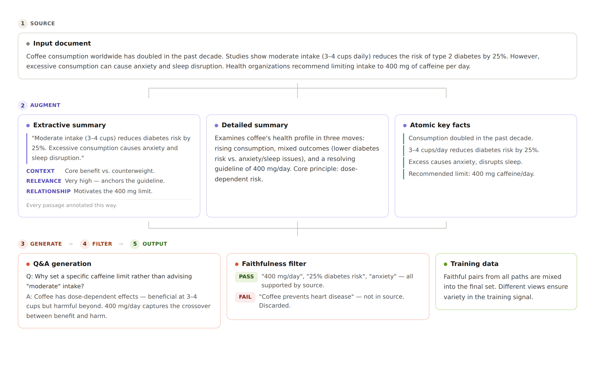

# Data Generation Pipeline

  

## 1. Document Summarization

To bootstrap the process, we generate **three complementary types of summaries** for each source document. This ensures the model captures content at multiple levels of abstraction:

* **Detailed Summaries** – Rich, comprehensive overviews of the document.
* **Extractive Summaries** – Directly extracted sentences and passages representing the most important parts.
* **Atomic Facts** – Concise, standalone factual statements distilled from the text.

This multi-perspective approach improves the model's ability to **memorize, generalize, and recall** key knowledge.

---

## 2. Synthetic Q\&A Generation

With summaries in place, we scale up training data via **synthetic Q\&A generation**:

* Users provide a small set of **seed examples** (initial Q\&A pairs).
* The pipeline uses these seeds to generate a large set of **contextually grounded Q\&A pairs**, tightly linked to the summarized documents.
* This expands sparse seed data into a **rich, diverse training dataset** suitable for fine-tuning.

---

## 3. Quality Control

High-quality training data is essential. To ensure faithfulness and accuracy, we employ a **teacher-model evaluation loop**:

1. Provide the model with a generated answer and the original document.
2. Ask it to extract each factual claim from the answer.
3. Verify whether each claim is **explicitly supported** by the document.

Only claims passing this check are retained. This process filters out **hallucinations and unsupported statements**, ensuring reliable Q\&A pairs.
