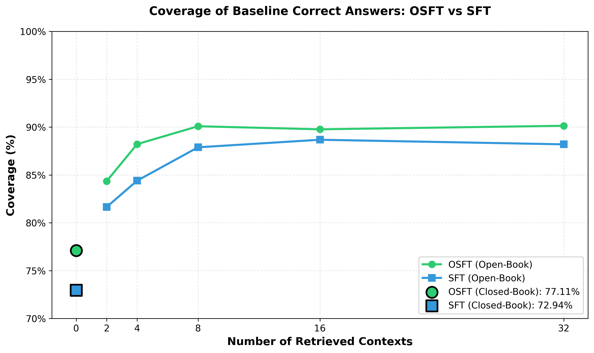

# Multilingual Support

The knowledge generation notebook supports generating training data in **any language**. Translated flow variants are resolved automatically — if a pre-translated flow exists it is used directly, otherwise `translate_flow()` creates one on-demand using an LLM.

## Quick Start

1. Copy `.env.example` to `.env` and configure your model endpoint.
2. Set the multilingual variables:

   ```dotenv
   SDG_LANG=Spanish
   SDG_LANG_CODE=es
   ```

3. Run `knowledge_generation.ipynb` as normal. The notebook detects these variables and uses translated flows.

To revert to English, remove or leave `SDG_LANG` empty.

## Configuration Reference

| Variable | Description | Example |
|----------|-------------|---------|
| `SDG_LANG` | Target language name (empty = English) | `Spanish`, `French`, `Japanese` |
| `SDG_LANG_CODE` | ISO 639-1 language code | `es`, `fr`, `ja` |
| `TRANSLATED_FLOWS_DIR` | Directory with pre-translated flows (optional) | `./translated_flows` |
| `TRANSLATOR_MODEL` | LLM for translation (litellm format) | `openai/gpt-4o` |
| `TRANSLATOR_API_KEY` | API key for translator model | |
| `TRANSLATOR_API_BASE` | Custom API base URL (optional) | |
| `VERIFIER_MODEL` | LLM for translation verification | `openai/gpt-4o` |
| `VERIFIER_API_KEY` | API key for verifier (if different) | |
| `VERIFIER_API_BASE` | Custom API base URL for verifier (optional) | |

## How It Works

1. The notebook reads `SDG_LANG` and `SDG_LANG_CODE` from the environment.
2. For each of the four generation flows (extractive summary, detailed summary, key facts, document-based Q\&A), it checks `FlowRegistry` for a translated variant named `<Flow Name> (<Language>)`.
3. If found, it uses the existing translated flow. If not, it calls `translate_flow()` which:
   - Translates all prompt YAMLs using the configured translator model.
   - Verifies each translation with a second LLM pass.
   - Creates an adapted `flow.yaml` with updated metadata and prompt paths.
   - Registers the new flow with `FlowRegistry` for immediate use.

## Pre-translated Flows

The repository ships with **Spanish (`es`)** flows under `src/sdg_hub/flows/knowledge_infusion/enhanced_multi_summary_qa_es/`. These are auto-discovered and require no extra setup — just set `SDG_LANG=Spanish` and `SDG_LANG_CODE=es`.

---

## Spanish Benchmark Results

We evaluated Spanish knowledge tuning using the same QuALITY benchmark (translated to Spanish), comparing a baseline Llama-3.1-8B-Instruct model against SFT and OSFT variants trained on Spanish-translated synthetic data.

**Training token count:** 42,653,497

<p align="center">
  
</p>

<p align="center">
  <em>Figure: Spanish QuALITY benchmark accuracy across retrieved context sizes. SFT on translated data yields consistent gains over the baseline in both open-book and closed-book settings.</em>
</p>

| # Contexts Retrieved | Baseline | SFT | OSFT |
|:--------------------:|---------:|----:|-----:|
| 0 (Closed Book)      |   44.47% | **48.92%** | 47.16% |
| 2                    |   49.01% | **55.49%** | 52.75% |
| 4                    |   54.25% | **59.81%** | 58.26% |
| 8                    |   60.03% | **65.84%** | 63.51% |
| 16                   |   64.61% | **68.80%** | 68.14% |
| 32                   |   65.71% |   68.88% | **69.68%** |

> **Experiment settings:** SFT and OSFT both use a learning rate of 2e-5. OSFT uses an unfreeze rank ratio (URR) of 0.2.

## Coverage of Baseline Correct Answers: OSFT vs SFT

While both SFT and OSFT improve overall accuracy, an important question is: **how many of the baseline model's originally correct answers does each method retain?** Standard SFT substantially drives the model away from its current behavior, risking loss of existing knowledge. OSFT, by contrast, restricts weight updates to orthogonal subspaces, giving finer control over how much the model departs from its current behavior while still adding new parametric knowledge. For a deeper dive into the OSFT method, see the [OSFT Comprehensive Tutorial in Training Hub](https://github.com/Red-Hat-AI-Innovation-Team/training_hub/blob/main/examples/notebooks/osft_comprehensive_tutorial.ipynb).

We measure *coverage* as the percentage of questions the baseline model answers correctly that the fine-tuned model also answers correctly. Higher coverage means less forgetting of existing capabilities.

<p align="center">
  
</p>

<p align="center">
  <em>Figure: Coverage of baseline correct answers across retrieved context sizes. OSFT consistently retains a higher proportion of the baseline's correct answers compared to SFT, demonstrating better preservation of existing model knowledge.</em>
</p>

| # Contexts Retrieved | SFT Coverage | OSFT Coverage |
|:--------------------:|-------------:|--------------:|
| 0 (Closed Book)      |       72.94% |        77.11% |
| 2                    |       81.65% |        84.35% |
| 4                    |       84.40% |        88.22% |
| 8                    |       87.89% |        90.09% |
| 16                   |       88.68% |        89.77% |
| 32                   |       88.20% |        90.14% |

OSFT achieves **84–90% coverage** across open-book settings, compared to SFT's **82–89%**, meaning OSFT consistently retains more of the baseline's correct answers while still gaining new ones.

## General Performance Preservation

An important concern with domain- and language-specific fine-tuning is whether general instruction-following capabilities degrade. We evaluated both SFT and OSFT models on the **Open LLM Leaderboard v2** benchmarks and **MMLU-ProX Spanish** to verify that general performance is preserved.

### Open LLM Leaderboard v2 - Qwen3-8B

| Benchmark | Baseline | OSFT | SFT |
|-----------|--------:|---------:|--------:|
| MMLU-Pro (acc) | 47.56% | 47.37% | 47.06% |
| BBH (acc_norm) | 60.93% | 57.92% | 58.06% |
| GPQA (acc_norm) | 36.24% | 37.16% | 35.65% |
| MATH-Hard (exact_match) | 53.25% | 49.55% | 49.40% |
| IFEval (prompt_strict) | 25.51% | 28.10% | 29.94% |
| MuSR (acc_norm) | 43.12% | 40.87% | 42.72% |

### MMLU-ProX Spanish

| Benchmark | Baseline | OSFT | SFT |
|-----------|--------:|---------:|--------:|
| MMLU-ProX ES (exact_match) | 56.08% | 55.30% | 55.26% |

Both fine-tuned models preserve general performance well — **less than 1% average drop** on the Open LLM Leaderboard v2.
