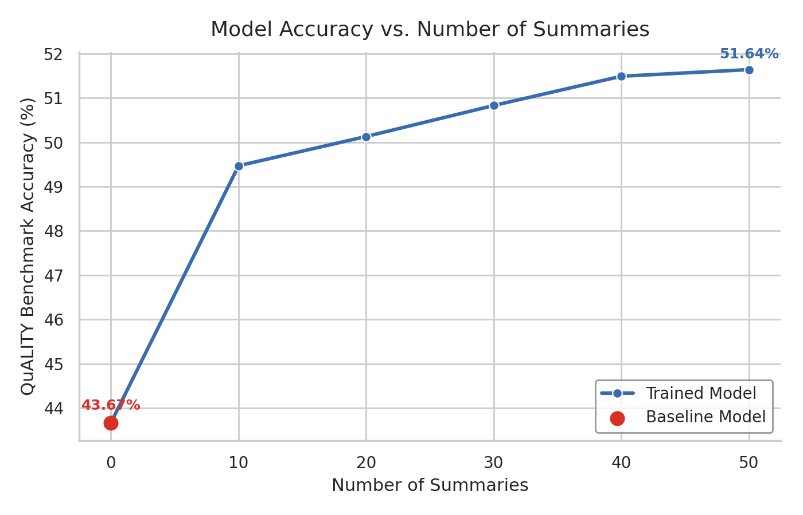

# SFT Benchmark Results

**Teacher model for generation:** `openai/gpt-oss-120b`
**Student model trained:** `meta-llama/Llama-3.1-8B-Instruct`
**Training method:** Supervised Fine-Tuning (SFT)

---

## Summary Augmentation

For each document, we generate three augmentation types—detailed summaries, extractive summaries, and atomic facts. Each "cut" on the table below represents the total number of summary augmentations per document (i.e., how many times each augmentation process is run).

<table>
  <caption><b>Table 1: Token count statistics for different numbers ("cuts") of summary augmentations per document.</b></caption>

| Cut (NUMBER\_OF\_SUMMARIES) | Token Count   |
| ------------------------------- | ------------- |
| Input Corpus                    | 1,517,465     |
| 10                              | 87,248,889    |
| 20                              | 158,615,276   |
| 30                              | 230,306,195   |
| 40                              | 301,805,906   |
| 50                              | 373,183,414   |
</table>

---

## Benchmark Results

- **Evaluation benchmark:** [QuALITY benchmark](https://nyu-mll.github.io/quality/)
- **Evaluation script & metric:** [Synthetic_Continued_Pretraining](https://github.com/ZitongYang/Synthetic_Continued_Pretraining/blob/main/evaluation.py), Exact Match (EM)
- **Student model:** meta-llama/Llama-3.1-8B-Instruct (after SFT on generated/augmented summaries)
- **Performance metric:** Model accuracy

  

  <em>Figure: Model accuracy across the QuALITY benchmark datasets, comparing SFT training on enhanced document summaries with the original model performance.</em>

